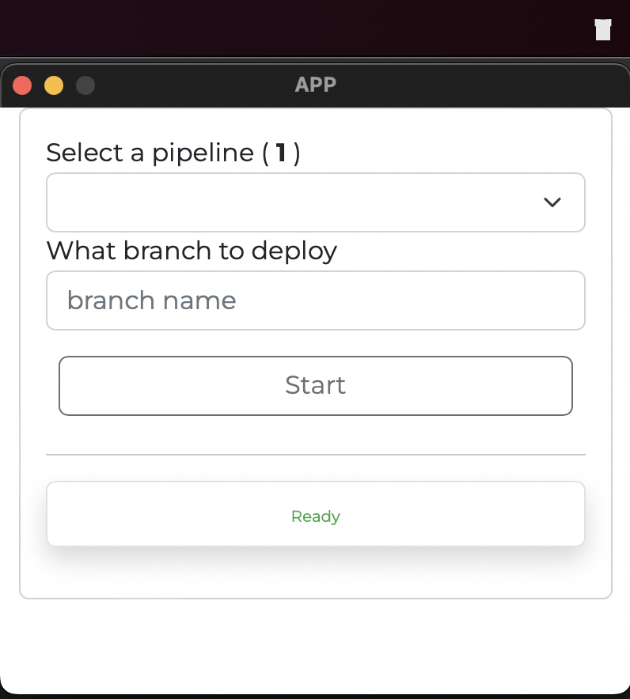

<div align="center">


<h2>1 Button 2 Inputs 1 Configuration</h2>

<p>A simple and configurable UI to Start and Update CodePipeline.</p>

<p align="center">
  <a href="https://github.com/yet-another-tool/1b2i1c/issues">Report Bug</a>
  ·
  <a href="https://github.com/yet-another-tool/1b2i1c/issues">Request Feature</a>
</p>
</div>

---

<details open="open">
  <summary>Table of Contents</summary>
  <ol>
    <li>
      <a href="#about">About</a>
    </li>
    <li><a href="#installation">Installation</a></li>
    <li>
      <a href="#usage">Usage</a>
    </li>
    <li><a href="#changelog">Changelog</a></li>
    <li><a href="#contributing">Contributing</a></li>
    <li><a href="#license">License</a></li>
    <li><a href="#contact">Contact</a></li>

  </ol>
</details>

---

## About

<div>
<b> | </b>
<a href="https://www.buymeacoffee.com/studiowebux" target="_blank"
      ></a>
<b> | </b>
<a href="https://webuxlab.com" target="_blank"
      > Webux Lab</a>
<b> | </b>
</div>

---

## Installation

**Prerequisites:**

Go to https://tauri.app/v1/guides/getting-started/prerequisites to install **Rust**

**_Then you can start the project locally:_**

```bash
npm install

npm run tauri dev
```

**_To build the application and share it:_**

```bash
npm run tauri build
# OR to build MacOS universal
rustup target add x86_64-apple-darwin
npx tauri build --target universal-apple-darwin
```

Enjoy !

---

## Usage

1. Create your configuration

```bash
nano ~/onebtwoionec.config.json
```

```json
{
  "authentication": {
    "github": {
      "api_key": "YOUR_PERSONAL_GITHUB_API_KEY"
    }
  },
  "pipelines": [
    {
      "friendlyName": "AWS ra-demo-repo-private",
      "pipeline": "test",
      "profile": "deployment",
      "region": "ca-central-1",
      "codePipelineActionName": "Source",
      "type": "codepipeline"
    },
    {
      "friendlyName": "GH ra-demo-repo-private",
      "workflow_id": "backend.yml",
      "repository": "ra-demo-repo-private",
      "owner": "yet-another-tool",
      "inputs": {},
      "type": "github"
    }
  ]
}
```

2. Then setup your **AWS credentials** as usual (I only tested the assume role using IAM user and role).

   > Required only if you are using AWS CodePipeline

3. When using **Github Actions**, you MUST provide the **branch name** manually (_aka `ref`_)

4. Finally open the application.



**Github Action Example** with the `workflow_dispatch` approach: [backend.yml](./docs/backend.yml)

---

## Changelog

### V1.1.0 - Added Github Actions - 2022-10-01

- Start Github Actions using the workflow_dispatch
- Added Github Personal Access Token
- Reworked the configuration file to implement multi providers
- Revamp the code structure
- Added Github Actions example

### V1.0.0 - CodePipeline - 2022-09-30

- Start CodePipeline 
- Update CodePipeline Source Branch Name

## Contributing

1. Create a Feature Branch
2. Commit your changes
3. Push your changes
4. Create a PR

<details>
<summary>Working with your local branch</summary>

**Branch Checkout:**

```bash
git checkout -b <feature|fix|release|chore|hotfix>/prefix-name
```

> Your branch name must starts with [feature|fix|release|chore|hotfix] and use a / before the name;
> Use hyphens as separator;
> The prefix correspond to your Kanban tool id (e.g. abc-123)

**Keep your branch synced:**

```bash
git fetch origin
git rebase origin/master
```

**Commit your changes:**

```bash
git add .
git commit -m "<feat|ci|test|docs|build|chore|style|refactor|perf|BREAKING CHANGE>: commit message"
```

> Follow this convention commitlint for your commit message structure

**Push your changes:**

```bash
git push origin <feature|fix|release|chore|hotfix>/prefix-name
```

**Examples:**

```bash
git checkout -b release/v1.15.5
git checkout -b feature/abc-123-something-awesome
git checkout -b hotfix/abc-432-something-bad-to-fix
```

```bash
git commit -m "docs: added awesome documentation"
git commit -m "feat: added new feature"
git commit -m "test: added tests"
```

</details>

## License

Distributed under the MIT License. See LICENSE for more information.

## Contact

- Tommy Gingras @ tommy@studiowebux.com | Studio Webux

---
